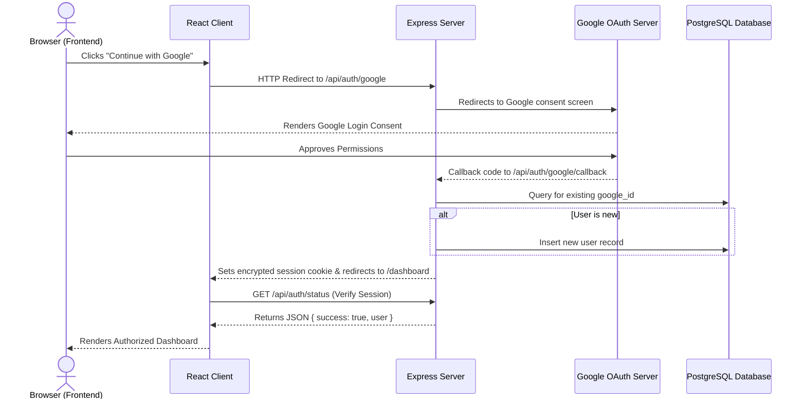
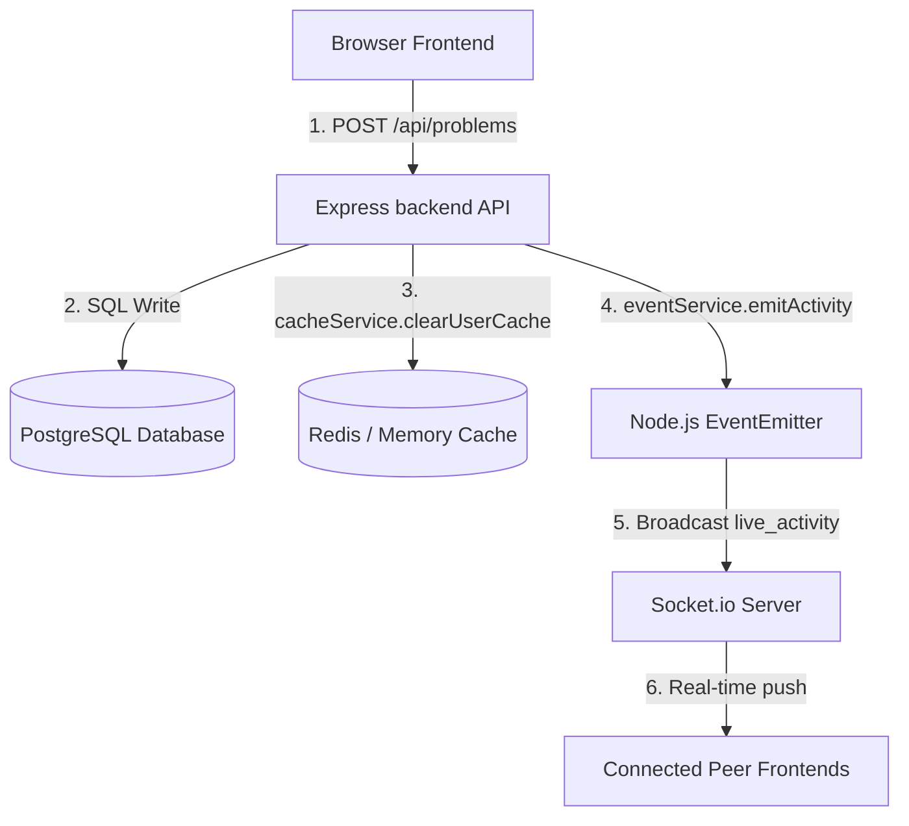
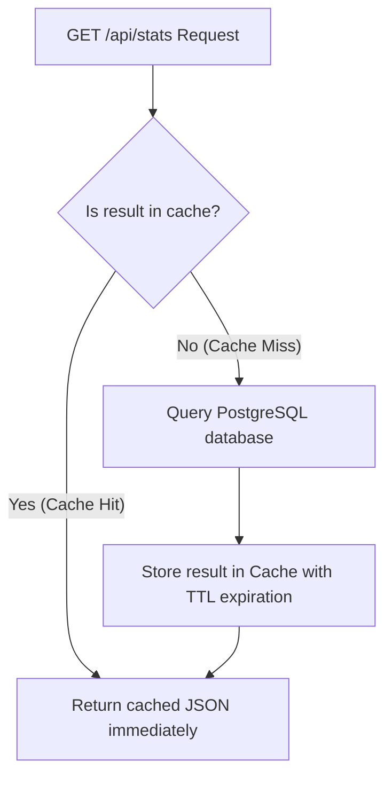

# TrackPrep: System Architecture & Project Flow Guide

This document maps out the directory layout, database interactions, authentication sequences, and cache configurations of the TrackPrep web application.

---

## 📂 Directory Layout

```
TrackPrep/
├── client/                     # Vite + React Frontend
│   ├── src/
│   │   ├── components/         # Modals & Sidebar UI components
│   │   ├── context/            # AuthContext (Handles auth state)
│   │   ├── pages/              # Views (Dashboard, Problems, Applications, Study Planner)
│   │   ├── services/           # API fetching (axios) & Socket.io service
│   │   ├── App.jsx             # React router structure & layouts
│   │   └── index.css           # Premium Glassmorphism & Gold/Espresso Theme styles
│   └── vite.config.js          # Proxy and rollup configurations
├── server/                     # Express.js REST API Backend
│   ├── src/
│   │   ├── config/             # DB Pool connection, Passport, & Socket.io server configs
│   │   ├── controllers/        # Request/Response handlers
│   │   ├── middleware/         # Auth checkers, session cookies, rate-limiters
│   │   ├── routes/             # REST endpoints (/api/problems, /api/auth...)
│   │   ├── services/           # SQL queries, dynamic Redis cache layers, cron schedulers
│   │   └── app.js              # Express app setup, middlewares, and routing bindings
│   └── .env                    # Local environmental secrets
└── docker-compose.yml          # Container configuration (Client, Server, Postgres, Redis)
```

---

## 🔄 Core Architectural Flows

### 1. Authentication Pipeline (Google OAuth & Developer Mock)



*   **Mock Fallback Strategy**: If `DEV_MOCK_AUTH=true` is enabled in your configuration, you can use the **Developer Mock Login** button. This bypasses the Google OAuth redirection completely and creates a mock developer session (`id: 9999`) on the server instantly.

---

### 2. Live Activity & Event-Driven Notification Pipeline

When you log a new resolved problem, submit an application, or complete a planner task, a sequence of database writes, cache updates, and real-time socket events occurs:



1.  **Write Phase**: The API inserts the new record into PostgreSQL.
2.  **Invalidation Phase**: The backend clears any cached dashboard metrics for the user in Redis, ensuring subsequent reports fetch fresh results.
3.  **Broadcasting Phase**: An internal server event is emitted. The Socket.io container picks up this event and broadcasts a `live_activity` message (e.g. *"Alice solved Two Sum on LeetCode"*) to all active client web sockets.

---

### 3. Smart Caching Layer (PostgreSQL & Redis Cache)

To maintain sub-millisecond response times, database queries for dashboard metrics are cached:



*   **Robust Fallback**: The `cacheService` is built to be resilient. If the `redis` npm package is missing or the Redis server goes offline, the system automatically prints a warning and falls back to a **local, in-memory `Map` data structure** supporting TTL limits. The application continues running smoothly.
